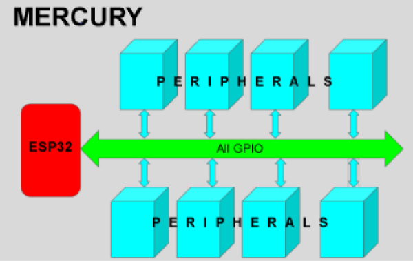
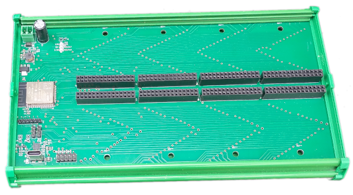
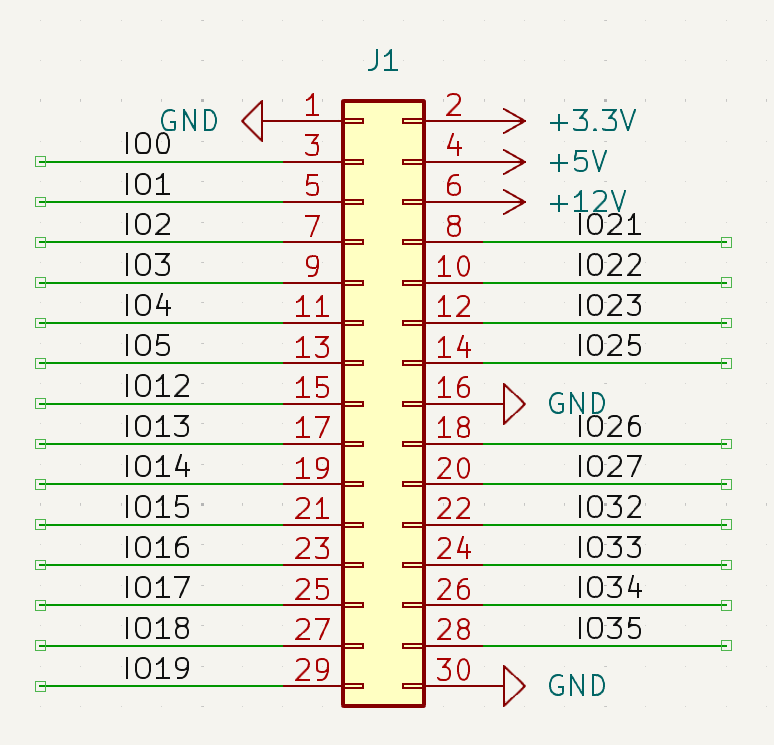
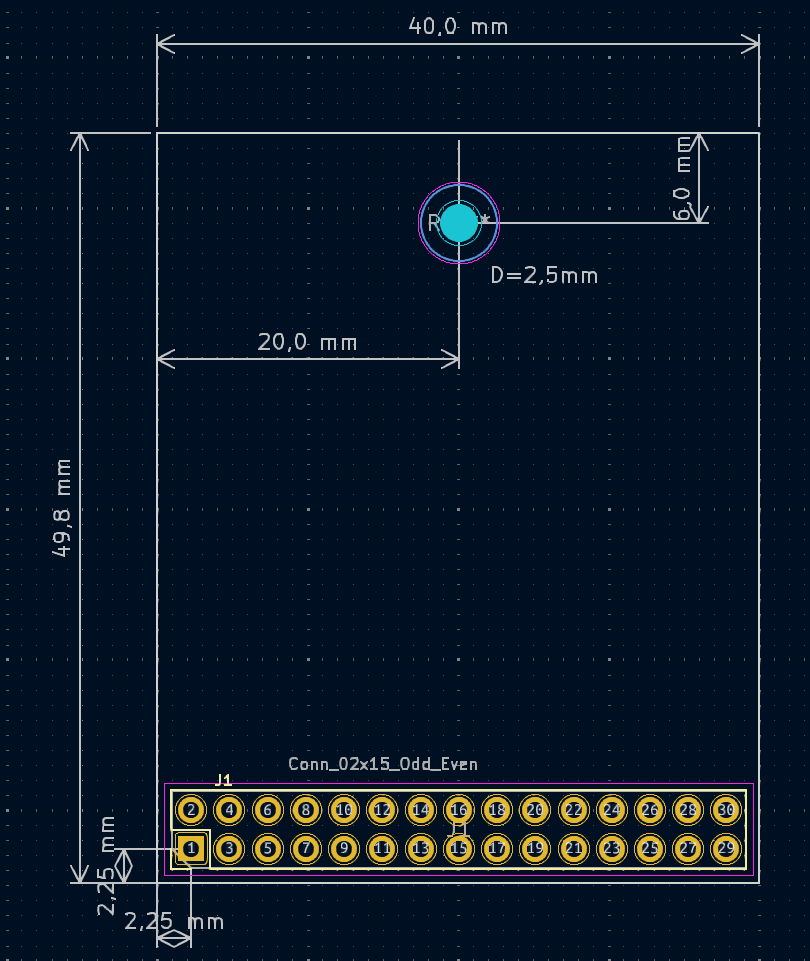
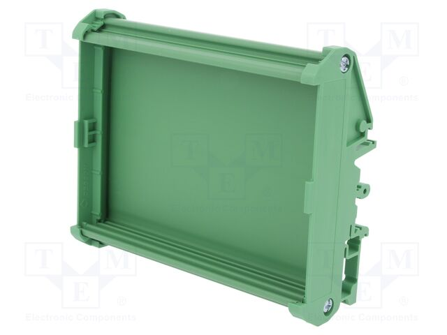

# MercuryBase_4slot

The idea behind the MERCURY project is to create a controller that doesn't contain any peripherals.   
The required peripheral modules can be inserted into the baseboard.
<picture></picture>   
<picture></picture>   
The housing is adapted for mounting on a DIN35 rail.  

The current list of available modules is provided below.
## Links:   
Hardware:   
1. <a href="https://github.com/krzychoooo/Mercury_PCB_Ethernet_V100" target="_blank">Mercury_PCB_Ethernet_V100</a>
2. <a href="https://github.com/krzychoooo/Mercury_PCB_NPNOUT_x8_V100" target="_blank">Mercury_PCB_NPNOUT_x8_V100</a>
3. <a href="https://github.com/krzychoooo/Mercury_PCB_Relay3x_V100" target="_blank">Mercury_PCB_Relay3x_V100</a>
4. <a href="https://github.com/krzychoooo/Mercury_PCB_UOut1-10V_V100" target="_blank">Mercury_PCB_UOut1-10V_V100</a>   
5. <a href="https://github.com/krzychoooo/Mercury_PCB_Inputx5_V100" target="_blank">Mercury_PCB_Inputx5_V100</a>   

Soft:   
1. <a href="https://github.com/krzychoooo/Mercury_Soft_UOut1-10V_V100" target="_blank">Mercury_Soft_UOut1-10V_V100</a>
2. <a href="https://github.com/krzychoooo/Mercury_Soft_RS485_V100" target="_blank">Mercury_Soft_RS485_V100</a>
3. <a href="https://github.com/krzychoooo/Mercury_Soft_Relay_x3_V100" target="_blank">Mercury_Soft_Relay_x3_V100</a>
4. <a href="https://github.com/krzychoooo/Mercury_Soft_Input5x_V1.0.0" target="_blank">Mercury_Soft_Input5x_V1.0.0</a>   

## Custom project.   
You can connect your own custom modules to the structure.   
These can be quickly created using the Kicad template I provided.   
<a href="https://github.com/krzychoooo/MercuryTemplate" target="_blank">Kicad Template</a>    
After loading the template, you'll see a connector in the schematic window along with the network names.   
<picture></picture>   
In the PCB window, you'll see the board outline with the correctly positioned connector.   
<picture></picture>   

## Mechanical Solutions:   
The MERCURY baseboard fits into the DM108-150-14-100AH ​​housing.
<picture></picture>
The housing is adapted for mounting on a DIN35 rail.
